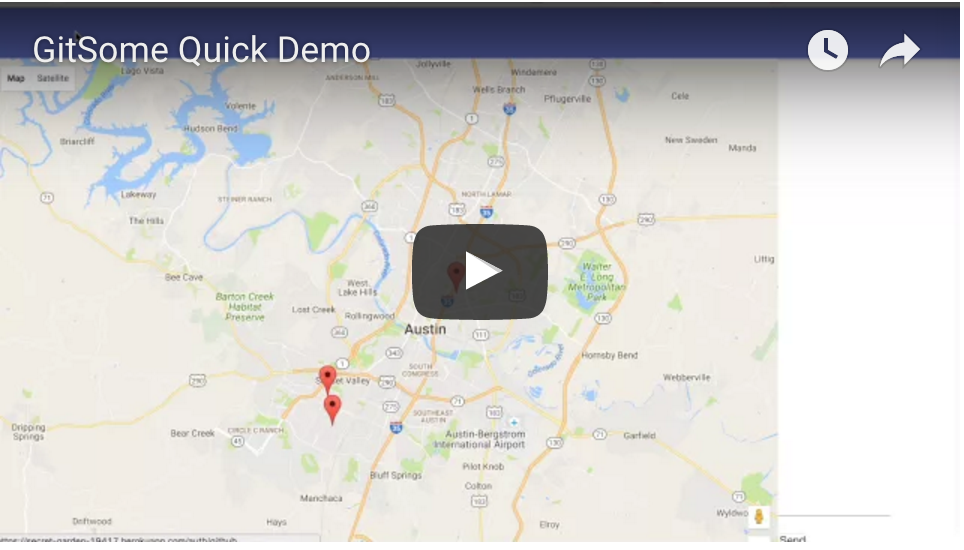

# GIT Some : coding buddies near you.

##LATEST NEWS

##README STRUCTURE
1. Announcements
2. README index
3. Requirements
5. Presentation
6. Grading Criteria

##REQUIREMENTS (when completed: list date completed and your name.)
1. Must use Node.js and Express.js for web server. (DONE. Michael: 8-5-2016)
2. Must be backed with MYSQL Database using Sequelize ORM (DONE. Michael: 8-11-2016. For maps+marker DB)
3. Must have both GET and POST routes (DONE. Michael: 8-11-2016. Can POST and GET maps marker data from DB)
4. Basic SEO (DONE. Cecile and Michael: 8-12-2016.)
5. Basic Framework Testing (not yet done)
6. Must deploy on Heroku (DEPLOYED. Cecile and Lee: 8-8-2016 via secret-garden and coding-buddies, not final version)
7. Must utilize new library (DONE. Michael: 8-7-2016 with sockets.io)
8. Must have polished UI (IN PROGRESS. Lee: current)
9. Must have MVC folder structure (DONE. Michael: 8-5-2016)
10. Must meet good quality coding standards (Need to comment our stuff pefore presentation day.)
11. OPTIONAL : Utilize handlebars.js templating engine (DONE. ALL: 8-7-2016)
12. OPTIONAL : Incorporate Authentication (DONE. Cecile for real 8-8-2016)
13. OPTIONAL : Use existing data set to power database (DONE. Michael: 8-11-2016. Using geolocate data to populate our DB.) 
14. OPTIONAL :  Create migration strategy (not yet done)

##PRESENTATION
1. Overall concept
2. Motivation for development
3. Design process
4. Technologies used
5. Demonstrate the applications functionality
6. Explain direction for future development

#####GRADING CRITERIA:
1. Concept
2. Design
3. Functionality
4. Collaboration
5. Presentation
6. Technical sophistication
